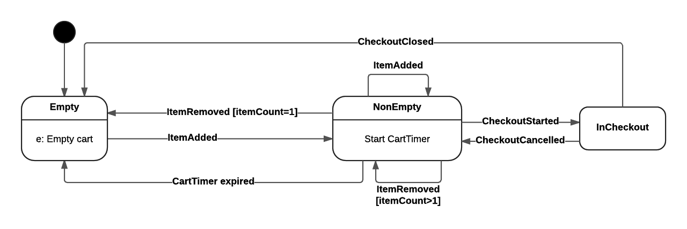

# Reactive programming in Scala<br>Lab 2: Designing actor systems

## Example 1: Toggle and BankApp

```git clone https://github.com/balis/reactive-lab2```

### Running in console

```
cd reactive-lab2
sbt "runMain reactive2.BankApp"
sbt "runMain reactive2.ToggleApp"
```

### Running in IntelliJ

**Method 1**: After opening the project, select `sbt shell` on the toolbar at the bottom of the screen, then type:
```
sbt "runMain reactive2.BankApp"
sbt "runMain reactive2.ToggleApp"
```

**Method 2**: right-click on the `object BankApp` and select `Run: BankApp`

### Configuration
Configuration of logging can be found in [src/main/resources/application.conf](https://github.com/agh-reactive/reactive-lab2/blob/master/src/main/resources/application.conf)

## Example 2: BuddyChat (legacy)

Updated version can be found here: [https://github.com/agh-reactive/buddychat](https://github.com/agh-reactive/buddychat)

### Running
```
git clone https://github.com/agh-reactive/buddychat.git
cd buddychat
sbt run
```

## Assignment: E-Shop system

Your assignment is to implement a part of an e-Shop system composed of actors **Cart** and **Checkout**

### Cart actor



### Checkout actor


### Separating domain logic
A good practice in actor system design is to separate the domain logic from the communication logic. For example, the `Cart` actor should not impelemnt both the state of the cart and the communication protocol, because testing the business logic (cart state) will not be possible in isolation, only through the asynchronous communication protocol. In this case, it is better to separate a `case class Cart` representing the domain object from `actor CartActor` implementing the communication protocol:

```
case class Cart(items: Seq[Any]) {
    def contains(item: Any): Boolean = ???
    def addItem(item: Any): Cart     = ???
    def removeItem(item: Any): Cart  = ???
    def size: Int                    = ???
  }


 class CartActor extends Actor {
    def receive = {
      case AddItem(item, count) => ???
      ...
    }
  }

  object CartActor {
    def apply(): Behavior[Command] = Behaviors.receiveMessage {
      case AddItem(item, count) => ???
      ...
    }
  }
```

## Assignments
#### (20 pts) Implement actors **CartActor** and **Checkout**
- Design messages as `Case classes`. Distinguish between messages-commands (e.g. `AddItem`) and messages-events (e.g. `ItemAdded`). More about this [here](https://www.informit.com/articles/article.aspx?p=2428369).
```
object CartActor {
    sealed trait Command
    case class AddItem(id: String) extends Command
    ...
    sealed trait Event
    case class ItemAdded(id: String) extends Event
  }
```
- Do sterowania maszyną stanów proszę wykorzystać standardowy mechanizm become.
- Proszę stworzyć aplikację, która wykonuje prosty test stworzonych aktorów.
- Do implementacji limitów czasowych proszę wykorzystać mechanizm timerów (do przeczytania również rozdział o Schedulerach). Aktor powinien zaplanować wysłanie wiadomości do samego siebie oznaczającej upłyniecie określonego terminu:
  - CartTimer: czas po jakim koszyk jest automatycznie opróżniany.
  - CheckoutTimer: czas po jakim rozpoczęta operacja finalizacji zakupu jest anulowana.
  - PaymentTimer: maksymalny czas oczekiwania na zrealizowanie płatności, po którym operacja zakupu jest anulowana.

#### (10 pkt) Proszę wykorzystać [Akka Typed](https://doc.akka.io/docs/akka/current/typed/actors.html) do implementacji Aktora TypedCartActor
#### (10 pkt) Proszę wykorzystać [Akka Typed](https://doc.akka.io/docs/akka/current/typed/actors.html) do implementacji Aktora TypedCheckout

## Implementation 
Do implementacji powyższych zadań proszę wykorzystać [przygotowany szablon z początkowymi testami](https://github.com/agh-reactive/reactive-scala-labs-templates) 

Testy uruchamiamy komendą `sbt test`.

Szablon został stworzony, aby ułatwić implementację zadań domowych i pozwolić na skupienie większej uwagi na implementacji istotnych części zadania. Może się zdarzyć, iż szablon w niktórych miejsach będzie wymagał poprawek. Takie poprawki można zgłaszać jako PR do odpowiedniego repozytorium na githubie - będzie to premiowane punktami za aktywność. Przy odbiorze zadań większy nacisk zostanie położony na zrozumienie poszczególnych fragmentów programów i mechanizmów akki.


## Submission
- Create a new private repository on github named `reactive-scala-labs`
- Add your teacher to this repository as collaborator with write access
- Clone the repo `https://github.com/agh-reactive/reactive-scala-labs-templates` and push it to the repo created in step 1
- Create branch `lab2-solution` and add your full name to `README.md` file
- Create a `Pull Request` from `lab2-solution` to `master` branch
- Send the link to the `PR` as a solution to this assigment
